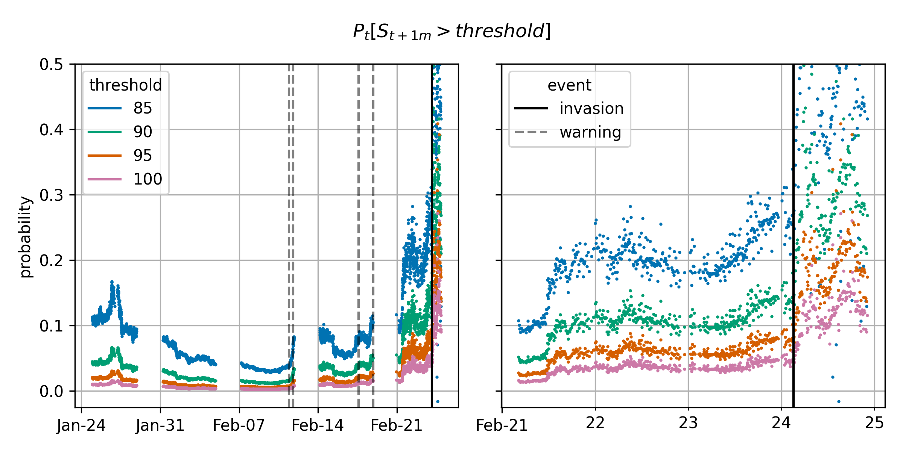

# fx option markets ahead of the russian invasion into ukraine

(with Akos Török)

* [introduction](#introduction)
* [assumptions](#assumptions)
* [replication](#replication)

## introduction

Did the FX options market expect the invasion announced on february 24 at 04:06 UTC+1? Assuming that option traders were thinking about a potential invasion and predicted USDRUB to stabilize at a certain level after it happens, we estimate the probability of such an invasion for some potential levels as follows:



To come to this conclusion, we equate the probability of invasion to that of the spot rate exceeding a certain high threshold when options expire. The latter probability is calculated by integrating the risk-neutral density of the spot rate at options' expiration (derived using the well-known result from [Breeden and Litzenberger (1978)](https://www.jstor.org/stable/2352653?seq=1#metadata_info_tab_contents)) from the threshold to a very large value.

Jump to [the walkthrough notebook](./walkthrough.ipynb) for more detailed calculations.

## assumptions
In the immediate run-up to the invasion (a week or so):
1. the FX market participants expected RUB to fall to the level of 85 RUB per 1 USD in case of an invasion;
1. USDRUB dynamics was strongly determined by expectations of an invasion and by little else;
1. the risk-neutral probability coincides with the physical probability (risk premium is zero);
1. the risk-neutral distribution did not have tails that could not be approximated by those of a spherical distribution;
1. markets were sufficiently liquid, and Bloomberg quotes are representative.

Assumptions 1-2 are alright: the time span of a week is short and the conflict was arguably the major driver of related asset prices. 

Assumption 3 is strong, as the risk-neutral probabilities are of course different from the physical ones, just as the insurance premium-based probability of a hurricane is different from the physical probability. However, we would imagine that the RUB investors' marginal utility negatively correlates with the the USDRUB spot returns, and that the risk-neutral probability overestimates the physical one.

Assumption 4 is prohibitively strong and compromises the very idea of estimating the probability of a tail risk event.

Assumption 5 is strong enough: we once asked JP Morgan for option quotes they supply to their customers, and those were way different than the once observed on Bloomberg on the same day. Also, we are using mid quotes here, and the bid-ask spreads are large.

## replication
### data

We provide the events with timestamps in `data/timeline.csv`, but it is your responsibility to fetch the price data and put it into a feather file called `usdrub-data-hf.ftr` in folder `data/` as described in the 'raw data' section of the [data processing notebook](notebooks/1-process-data.ipynb). Notebook [methodology](notebooks/2-methodology.ipynb) can be run without the need to supply this data.

### environment
Clone the repo somewhere and `cd` into the directory;

```bash
git clone https://github.com/ipozdeev/fx-options-ukraine-war
cd fx-options-ukraine-war
```

#### docker

if using [docker](https://www.docker.com/), all environment variables and dependencies are taken care of:
* build the image:
  ```bash
  docker build --tag fouw .
  ```
* run the container to get access jupyter and be able to run the notebooks:
  ```bash
  docker run \
    -p 8888:8888 \
    --user root \
    -e CHOWN_EXTRA="/home/jovyan/work" \
    -e CHOWN_EXTRA_OPTS="-R" \
    -v $(pwd):/home/jovyan/work \
    -e JUPYTER_TOKEN='' \
    fouw
  ```
* follow the link as usual.

#### no docker
if no docker, you will have to create the environment yourself either with [poetry](https://python-poetry.org/):
```bash
cd path/to/fx-options-ukraine-war
poetry shell
```

or with `venv` from `requirements.txt`: 

```bash
python3 -m venv .venv
source .venv/bin/activate; 
pip install -r requirements.txt
```

and run

```bash
jupyter lab
```

Have fun!
