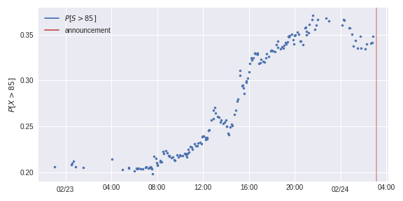

# fx-options-ukraine-war
Did the FX options market expect the invasion announced on 02/24 04:06 UTC+1? The implied probability I estimate gives a hint:

]

jump to [walkthrough](./walkthrough.ipynb) for results