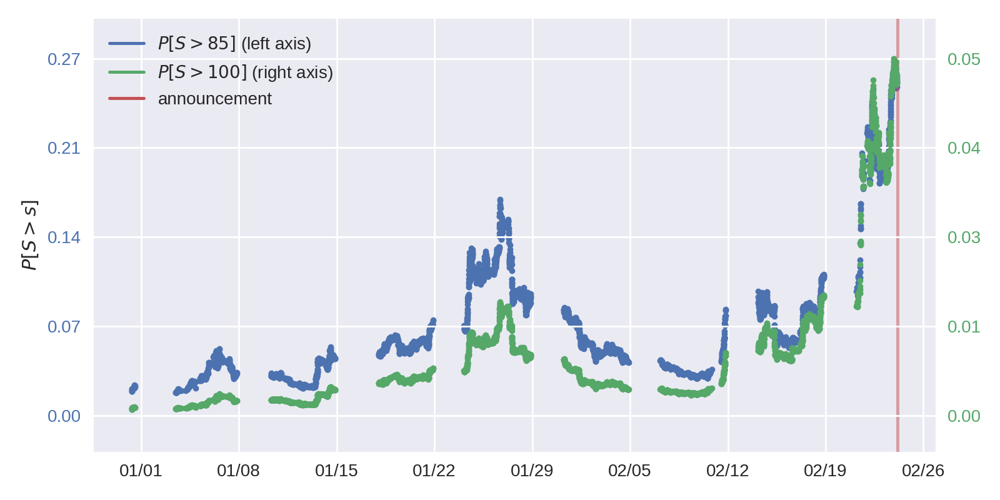
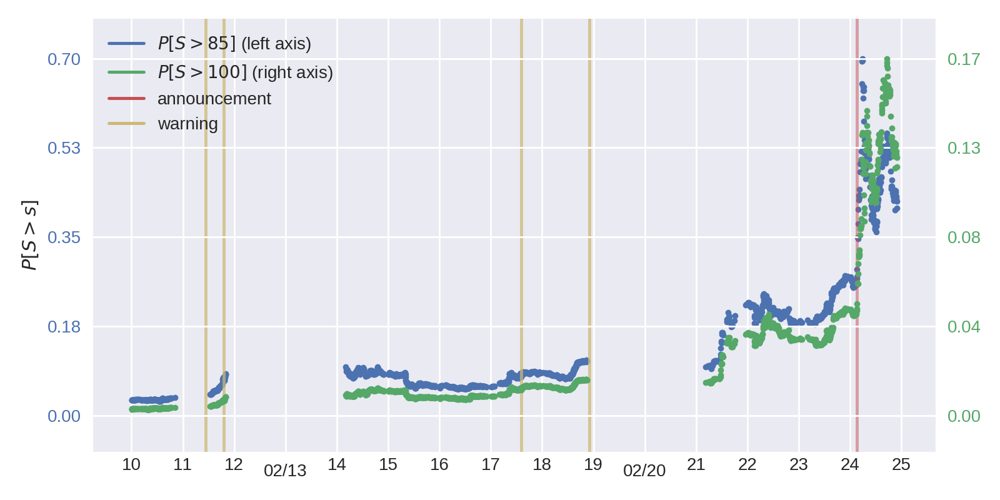

# fx-options-ukraine-war

(with Akos Török)

On February 24th 04:06 UTC+1, the "special military operation" was announced 
by the Russian president and the Russian army invaded Ukraine. In the run-up 
to the event, there had been warnings by US officials about the possibility 
of this outcome. Was the invasion expected by the FX market &ndash; a known 
barometer of a country's economic well-being? Did the warnings reinforce the 
expectation?

To answer these questions, we assume that option traders were thinking about a 
potential invasion and predicted USDRUB to stabilize at a certain level one 
month after it happens, we estimate the probability of such an invasion for 
two potential levels as follows:



The following figure zooms in on the periods with warnings by the US 
officials, as described in file [timeline.csv](./data/timeline.csv):


Unfortunately, two of the warnings fall precisely before a period of data 
unavailability. Of the two remaining ones, the very first is associated with a 
slight rise in the probability of invasion after it, and the other &mdash; 
with no change at all. Hence, no conclusive evidence is present.

A brief summary is below; for a detailed code walkthrough, formulas and other 
results do check out [the walkthrough notebook](./walkthrough.ipynb).

* [assumptions](#assumptions)
* [methodology](#methodology)
* [code](#code)
* [requirements](#requirements)

## assumptions
In the immediate run-up to the invasion (a week or so):
1. the FX market participants expected RUB to fall to the level of 85 RUB per 1 USD in case of an invasion;
1. USDRUB dynamics was strongly determined by expectations of an invasion and by little else;
1. the risk-neutral probability coincids with the physical probability (risk premium is zero);
1. the risk-neutral distribution did not have tails that could not be approximated by those of a spherical distribution;
1. markets were sufficiently liquid, and Bloomberg quotes are representative.

Assumptions 1-2 are alright: the time span of a week is short and the 
conflict was arguably the major driver of related asset prices. 

Assumption 3 is strong, as the risk-neutral probabilities are of course 
different from the physical ones: had the market participants been asked 
directly about the probability of war, the answer would be different from what 
the asset prices tell, just as the insurance premium-based probability of a 
hurricane is different from the physical probability (in short, difference 
stems from the fact that people undervalue assets that pay off poorly in the 
states of high marginal utility). However, I would imagine that the RUB 
investors' marginal utility negatively correlates with the the USDRUB spot 
returns and that the risk-neutral probability arguably overestimates the 
physical one.

Assumption 4 is prohibitively strong and compromises the very idea of 
estimating the probability of a tail risk event.

Assumption 5 is strong enough: we once asked JP Morgan for option quotes they 
supply to their customers, and those were way different than the once observed 
on Bloomberg on the same day. Also, we are using mid quotes here, and the 
bid-ask spreads are large.


## methodology
To estimate the probability of the spot rate exceeding a certain threshold, I integrate the risk-neutral density of the spot rate extracted non-parametrically over a suitable domain.

The well-known result from [Breeden and Litzenberger (1978)](https://www.jstor.org/stable/2352653?seq=1#metadata_info_tab_contents) equates the risk-neutral density of the underlying to the second derivative of the option pricing function w.r.t. the strike price.
Here, I take the option pricing function to be the Black-Scholes formula at the level of a SABR implied volatility as a function of a strike price. The SABR volatility smile is calibrated to the FX option contracts as described in 
["Foreign Exchange Option Pricing: A Practitioner's Guide"](https://books.google.ch/books?id=7vua-0-2sgMC&redir_esc=y) by Iain Clark.


## code
The code is written in python and located in directory `src/`. A detailed walkthrough is in form of a [jupyter notebook](./walkthrough.ipynb).


## requirements
* required packages are in `requirements.txt`:

    ```bash
    python3 -m venv pyenv; source pyenv/bin/activate; pip install -r requirements.txt
    ```

* additionally, package [optools](https://github.com/ipozdeev/optools) must be downloaded where python can find it;
* environment variable `PROJECT_ROOT` must be set to the local repository;
* feather file `usdrub-data-raw.ftr` must exist in `data/` (details in `src/datafeed_/downstream.py`) 

have fun!